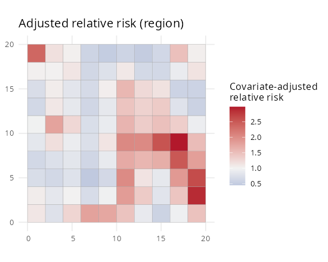
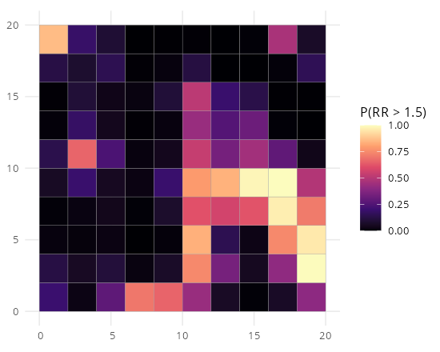
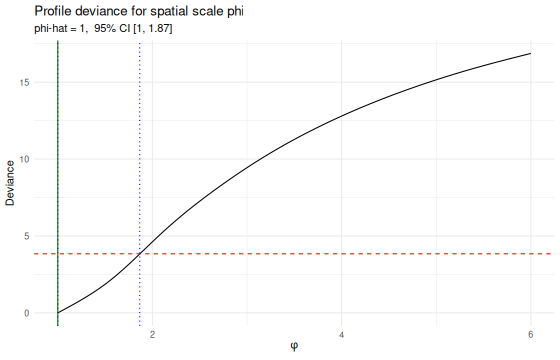

# SDALGCP2

<!-- badges: start -->
[](https://github.com/olatunjijohnson/SDALGCP2/actions/workflows/R-CMD-check.yaml)
<!-- badges: end -->

A faster, modernised successor to
[**SDALGCP**](https://github.com/olatunjijohnson/SDALGCP) for fitting a
**S**patially **D**iscrete **A**pproximation to a **L**og-**G**aussian **C**ox
**P**rocess (SDA-LGCP) to spatially aggregated disease counts
(Johnson, Diggle & Giorgi, 2019).

SDALGCP2 keeps the statistical method but

- moves the performance-critical kernels (aggregated correlation assembly, the
  Newton Laplace mode + MALA sampler, and the Monte Carlo likelihood) into
  **C++ via RcppArmadillo + OpenMP** — **~8–10× faster** end-to-end on a
  64-region example, returning the *same* estimates as `SDALGCP`;
- drops orphaned/legacy dependencies (`geoR`, `sp`, `raster`, `spacetime`,
  `mapview`, `splancs`, `pdist`, `maxLik`) for a lean `sf`/`terra`/`stars` stack;
- ships a proper **post-fit mapping & diagnostics** layer (relative-risk and
  uncertainty maps, exceedance probabilities, φ-profile CI, coefficient plots,
  residual Moran's I checking);
- adds a no-MCMC **Laplace fast path** for prediction.

See [`DESIGN.md`](DESIGN.md) for the full analysis, bottleneck ranking and roadmap.

> **Status:** active development. The spatial fit, prediction and visualisation
> are working and parity-verified against `SDALGCP`. Planned next: continuous-φ
> (grid-free) estimation, raster/continuous predictors via intensity-scale
> aggregation, a nugget term, importance-sampling diagnostics, and a
> Kronecker-free spatio-temporal path.

## Install

```r
# install.packages("remotes")
remotes::install_github("olatunjijohnson/SDALGCP2")
```

## Quick start (fully simulated, reproducible)

```r
library(SDALGCP2)
library(sf)

set.seed(1)
shp <- st_sf(geometry = st_make_grid(
  st_as_sfc(st_bbox(c(xmin = 0, ymin = 0, xmax = 20, ymax = 20))), n = c(10, 10)))
N <- nrow(shp)

# simulate aggregated counts with a spatial signal + covariate
pts  <- sda_points(shp, delta = 1, method = 3)
corr <- precompute_corr(pts, seq(1, 6, length.out = 10))
Sig  <- 0.6 * corr$R[, , 5]
x1   <- as.numeric(scale(rowSums(st_coordinates(st_centroid(shp)))))
pop  <- round(runif(N, 500, 3000))
y    <- rpois(N, pop * exp(cbind(1, x1) %*% c(-6, 0.4) +
                           as.numeric(t(chol(Sig)) %*% rnorm(N))))
dat  <- data.frame(y = y, x1 = x1, pop = pop)

# fit (points -> correlation -> Monte Carlo ML), all in one call
ctrl <- control_mcmc(n.sim = 6000, burnin = 1500, thin = 6, h = 1.65 / N^(1/6))
fit  <- SDALGCP2(y ~ x1 + offset(log(pop)), dat, shp,
                 delta = 1, phi = seq(1, 6, length.out = 10), control.mcmc = ctrl)
summary(fit)

# predict and map
pred_d <- predict(fit, type = "discrete")
pred_c <- predict(fit, type = "continuous", sampler = "laplace", cellsize = 0.7)

plot(pred_d, "ARR", midpoint = 1)        # covariate-adjusted relative risk
plot(pred_c, "RR", bound = shp)          # continuous relative-risk surface
map_exceedance(pred_d, threshold = 1.5)  # hotspot probabilities
phi_profile(fit)                         # profile-deviance CI for phi
coef_plot(fit)                           # estimates with CIs
model_check(fit, pred_d)                 # observed vs fitted + residual Moran's I
```

## What you get after fitting

| Adjusted relative risk | Exceedance P(RR > 1.5) | Profile deviance for φ |
|:---:|:---:|:---:|
|  |  |  |

## Estimating the spatial scale: grid vs direct

The scale `phi` enters only through a **double integral** of the correlation
function over each pair of regions,
`R_ij(phi) = ∫∫ w_i(x) w_j(y) exp(-||x-y||/phi) dx dy`, approximated by a weighted
sum over candidate points. `SDALGCP2` offers two ways to estimate it:

```r
fit_grid   <- SDALGCP2(..., phi_method = "grid")    # profile over the phi grid (default)
fit_direct <- SDALGCP2(..., phi_method = "direct")  # optimise phi continuously
```

The **direct** method differentiates *through* the integral (closed-form
`dR/dphi`, `d²R/dphi²`) and optimises `(beta, sigma², phi)` jointly, so it avoids
grid-discretisation error and returns a proper **standard error for `phi`** from
the joint Hessian. Full, numerically-verified derivation:
[`math/continuous-phi-derivation.pdf`](math/continuous-phi-derivation.pdf).

## Speed vs SDALGCP

Identical estimates, full pipeline (`scripts/compare_vs_SDALGCP.R`):

```
True:      beta=(-6, 0.5)       sigma2=0.5    phi=2.5
SDALGCP2:  beta=(-5.738,0.474)  sigma2=0.687  phi=1     [1.0s]
SDALGCP:   beta=(-5.738,0.474)  sigma2=0.687  phi=1     [8.4s]
```

## References

Johnson, O., Diggle, P. & Giorgi, E. (2019). A spatially discrete approximation
to log-Gaussian Cox processes for modelling aggregated disease count data.
*Statistics in Medicine* 38, 4871–4887. \doi{10.1002/sim.8339}
