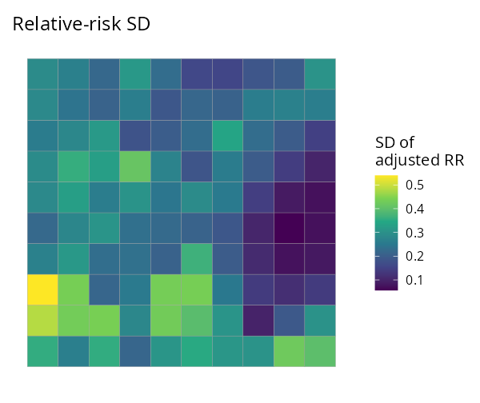
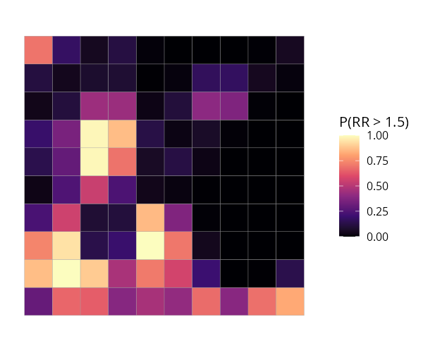

# SDALGCP2 

<!-- badges: start -->
[](https://github.com/olatunjijohnson/SDALGCP2/actions/workflows/R-CMD-check.yaml)
[](https://olatunjijohnson.github.io/SDALGCP2/)
<!-- badges: end -->

**Fast, modern disease mapping.** SDALGCP2 fits a spatially discrete approximation
to a log-Gaussian Cox process (SDA-LGCP) to spatially **aggregated disease counts**,
with a one-line, `glm`-like interface and C++ speed. The method is described in
Johnson, Diggle & Giorgi (2019, *Statistics in Medicine*,
[doi:10.1002/sim.8339](https://doi.org/10.1002/sim.8339)).

## Installation

```r
# install.packages("remotes")
remotes::install_github("olatunjijohnson/SDALGCP2")
```

You need a C++ toolchain (Rtools on Windows, Xcode CLT on macOS) because the
performance-critical kernels are compiled.

## Quick start — one line to fit

`data` is an `sf` object whose columns hold the response, covariates and offset.
Everything else (candidate-point spacing, the spatial scale, MCMC settings) is
chosen automatically.

```r
library(SDALGCP2)

fit <- sdalgcp(cases ~ deprivation + offset(log(population)), data = regions)

summary(fit)              # glm-style coefficient table + spatial parameters
rr  <- predict(fit)       # an sf: relative_risk, relative_risk_se, adjusted_rr, adjusted_rr_se
plot(fit)                 # relative-risk map
plot(fit, "exceedance", threshold = 1.5)   # hotspot probabilities
```

That is the whole workflow. The same `sdalgcp()` call also covers:

| You want… | Add… |
|---|---|
| raster (continuous) covariates | `rasters = my_raster` (enter on the intensity scale) |
| a spatio-temporal model | `time = "year"` |
| population-weighted aggregation | `popden = pop_raster` |

## What you get

| Relative risk | Uncertainty (SD) | Exceedance P(RR > 1.5) | Continuous surface |
|:---:|:---:|:---:|:---:|
|  |  |  |  |

## Why SDALGCP2

- **Easy:** `sdalgcp(formula, data)` — feels like `glm()`; sensible defaults so a
  first fit needs no tuning.
- **Fast:** aggregated correlation assembly, the MALA sampler and the Monte Carlo
  likelihood run in C++ (RcppArmadillo + OpenMP) — **8–10× faster end-to-end** than
  the original, returning the same estimates (see [Performance](#performance)).
- **Grid-free scale:** the spatial scale `φ` is optimised continuously by default
  (no grid), with a proper standard error — see the
  [derivation PDF](math/continuous-phi-derivation.pdf).
- **Continuous covariates done right:** rasters enter on the intensity scale
  (log-sum-exp), not by averaging predictors over polygons — see the
  [raster PDF](math/raster-covariates-derivation.pdf).
- **Spatio-temporal** without ever forming the `(N·T)²` covariance.
- **Honest uncertainty:** re-anchored Monte Carlo likelihood, importance-sampling
  diagnostics, a nugget term, model checking (residual Moran's I).

## Tutorials

See the [package website](https://olatunjijohnson.github.io/SDALGCP2/) for
worked, reproducible articles:

- **Spatial disease mapping** — the full workflow end to end.
- **Raster predictors** — intensity-scale covariates vs naive areal averaging.
- **Spatio-temporal** — space-time relative risk.
- **Estimating the scale** — grid (`scale = "grid"`) vs continuous
  (`scale = "continuous"`) `φ`.

## Reference

Johnson, O., Diggle, P. & Giorgi, E. (2019). A spatially discrete approximation to
log-Gaussian Cox processes for modelling aggregated disease count data.
*Statistics in Medicine* 38, 4871–4887. \doi{10.1002/sim.8339}
