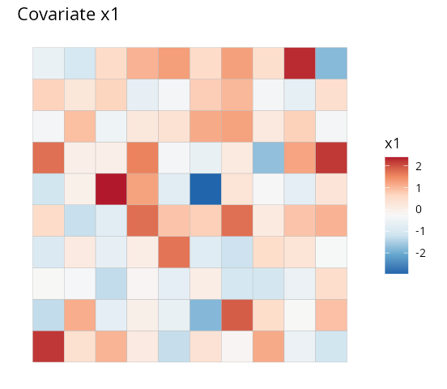
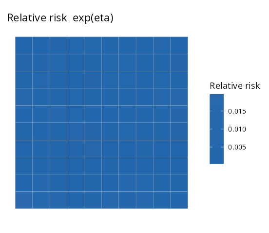
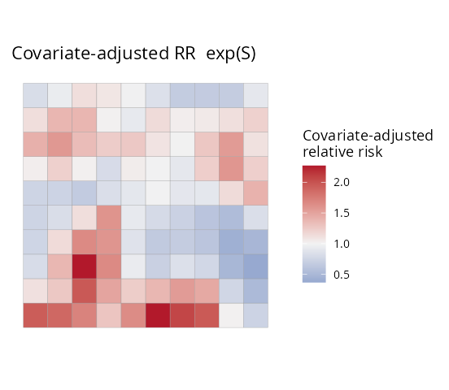
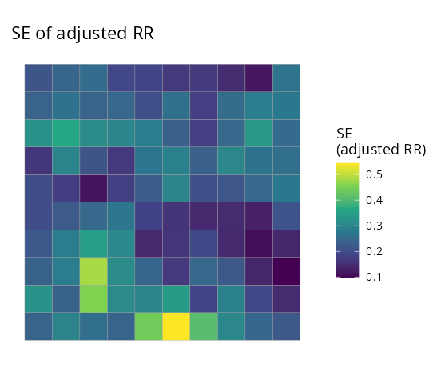
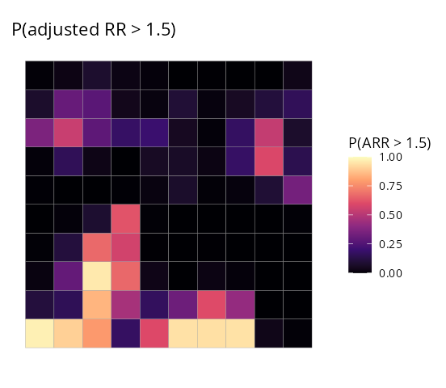

# 1. Spatial disease mapping with SDALGCP2

This tutorial fits a spatial disease-mapping model end to end and is
fully self-contained: every code block below runs as shown (set a seed
and copy-paste).

## The model

We observe disease counts $`Y_i`$ aggregated over areal units $`A_i`$
($`i=1,\dots,N`$) with an offset $`m_i`$ (the expected count,
e.g. population times a baseline rate). SDALGCP2 fits a **spatially
discrete approximation to a log-Gaussian Cox process**:
``` math
Y_i \mid S \;\sim\; \mathrm{Poisson}\!\big(m_i\, e^{\eta_i}\big),
\qquad
\eta_i \;=\; d_i^\top\beta \;+\; S_i,
```
where $`d_i`$ are area-level covariates and $`S=(S_1,\dots,S_N)`$ is a
Gaussian spatial random effect. $`S_i`$ is the average over area $`A_i`$
of a continuous Gaussian process $`S(x)`$ with exponential covariance
$`\mathrm{Cov}\{S(x),S(x')\}=\sigma^2\exp(-\lVert x-x'\rVert/\phi)`$;
aggregating this process over the areas gives an $`N\times N`$
covariance built from candidate points inside each region (see
Tutorial 4). The parameters are the coefficients $`\beta`$, the spatial
variance $`\sigma^2`$ and the range $`\phi`$.

Two quantities are reported for every area:

- **Relative risk** $`\mathrm{RR}_i=e^{\eta_i}=e^{d_i^\top\beta+S_i}`$ —
  the full relative risk, including the covariate effect;
- **Covariate-adjusted relative risk** $`\mathrm{ARR}_i=e^{S_i}`$ — the
  residual spatial relative risk *after* adjusting for covariates (where
  is risk high/low beyond what the covariates explain?).

## Simulate a data set

[`sdalgcp()`](https://olatunjijohnson.github.io/SDALGCP2/reference/sdalgcp.md)
takes an `sf` object whose columns hold the response, covariates and
offset. Here we simulate one; in practice this is your shapefile joined
to a counts table.

``` r

library(SDALGCP2)
library(sf)

set.seed(2024)
regions <- st_sf(geometry = st_make_grid(
  st_as_sfc(st_bbox(c(xmin = 0, ymin = 0, xmax = 20, ymax = 20))), n = c(10, 10)))
N <- nrow(regions)

# a spatial random effect, a covariate, a population offset, and Poisson counts
pts <- sda_points(regions, delta = 0.9, method = 3)
S   <- as.numeric(t(chol(0.5 * precompute_corr(pts, 4)$R[, , 1])) %*% rnorm(N))
regions$x1    <- rnorm(N)
regions$pop   <- round(runif(N, 800, 5000))
regions$cases <- rpois(N, regions$pop * exp(-6 + 0.6 * regions$x1 + S))
regions$SIR   <- regions$cases / (regions$pop * exp(-6))   # crude standardised ratio
```

The crude standardised incidence ratio (SIR) is noisy and over-fits
sparsely populated areas — exactly what a model smooths:

| Crude SIR (the data) |    Covariate `x1`    |
|:--------------------:|:--------------------:|
|  |  |

## Fit

One call. Candidate-point spacing, the spatial range and MCMC settings
are chosen automatically; `reanchor = 3` re-simulates the latent field
at the optimum a few times for reliable variance estimates.

``` r

fit <- sdalgcp(cases ~ x1 + offset(log(pop)), data = regions,
               control = sdalgcp_control(reanchor = 3))
summary(fit)
```

    #> Coefficients:
    #>             Estimate Std.Err z value Pr(>|z|)
    #> (Intercept)  -6.057   0.130  -46.78  < 2e-16 ***
    #> x1            0.664   0.040   16.49  < 2e-16 ***
    #> sigma^2       0.374   0.507    0.74     0.46
    #> phi           1.839   0.444    4.14  3.5e-05 ***
    #>
    #> Spatial scale phi: 1.84
    #> MC importance-sampling ESS: 208 / 1000 (21%);  log-lik MC SE: 0.062

The covariate effect `x1` is estimated at 0.66 (true value 0.6), the
spatial range `phi` and variance `sigma^2` describe the residual spatial
structure, and the importance-sampling effective sample size reports how
reliable the Monte Carlo likelihood is.

## Map the two relative risks

``` r

plot(fit, "RR")          # relative risk exp(eta)
plot(fit, "ARR")         # covariate-adjusted relative risk exp(S)
```

| Relative risk `RR` | Covariate-adjusted `ARR` |
|:------------------:|:------------------------:|
|      |           |

`RR` (left) is the overall pattern of risk; `ARR` (right) strips out the
covariate contribution and shows the *unexplained* spatial signal —
useful for spotting hotspots that the covariates do not account for.

## Uncertainty and exceedance

Every quantity comes with a standard error, and you can ask for the
probability that risk exceeds a policy threshold:

``` r

plot(fit, "ARR_se")                          # standard error of the adjusted RR
plot(fit, "exceedance", threshold = 1.5)     # P(adjusted RR > 1.5)
```

| SE of adjusted RR  | P(adjusted RR \> 1.5) |
|:------------------:|:---------------------:|
|  |        |

The exceedance map is usually the most decision-relevant output: it
flags areas that are confidently above the threshold rather than high by
chance.

## A continuous surface

Risk can also be predicted on a fine grid (change-of-support), giving a
smooth surface instead of a choropleth:

``` r

pc <- predict(fit, type = "continuous", sampler = "laplace", cellsize = 0.6)
plot(pc, "ARR", bound = regions)
```


[`predict()`](https://rspatial.github.io/terra/reference/predict.html)
returns all four quantities (`RR`, `ARR` and their `_se`) for both
`type = "discrete"` and `type = "continuous"`, and
[`exceedance()`](https://olatunjijohnson.github.io/SDALGCP2/reference/exceedance.md)
works on either.

## Model checking

Finally, check that the spatial term has absorbed the spatial structure:
the Pearson residuals should show no leftover spatial autocorrelation.

``` r

model_check(fit)
```


    #> Residual Moran's I = -0.114 (E = -0.010), p = 0.974

A non-significant residual Moran’s I (here $`p\approx0.97`$) indicates
the model has captured the spatial pattern, and the observed-vs-fitted
points lie around the identity line.

## Next

- [Raster
  predictors](https://olatunjijohnson.github.io/SDALGCP2/articles/raster-covariates.md)
  — continuous covariates done right.
- [Spatio-temporal](https://olatunjijohnson.github.io/SDALGCP2/articles/spatio-temporal.md)
  — space–time relative risk.
- [Estimating the
  scale](https://olatunjijohnson.github.io/SDALGCP2/articles/scale-grid-vs-continuous.md)
  — what $`\phi`$ is and how it is estimated.
- [Spatial
  confounding](https://olatunjijohnson.github.io/SDALGCP2/articles/spatial-confounding.md)
  and [misaligned
  covariates](https://olatunjijohnson.github.io/SDALGCP2/articles/misaligned-covariates.md).
  \`\`\`
