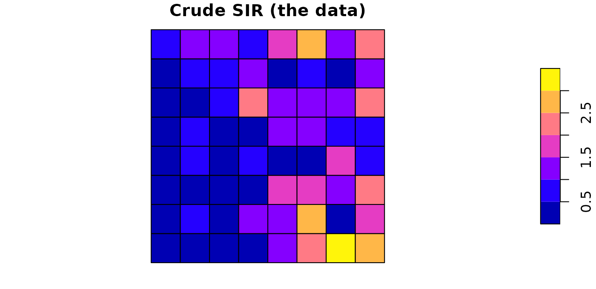
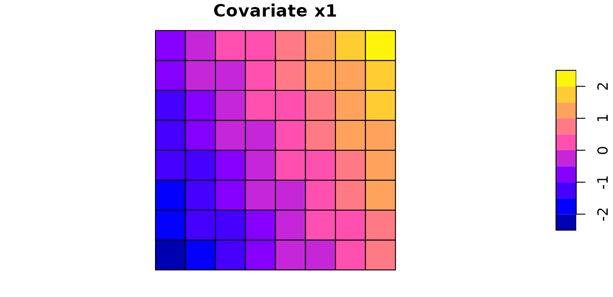
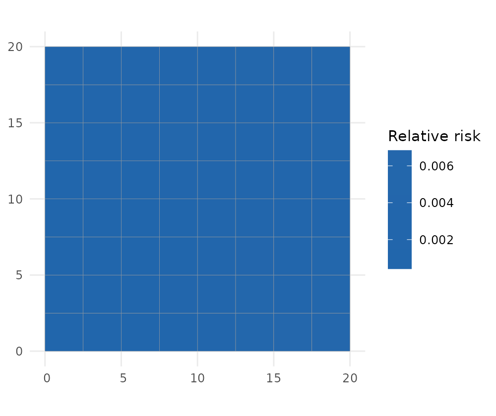
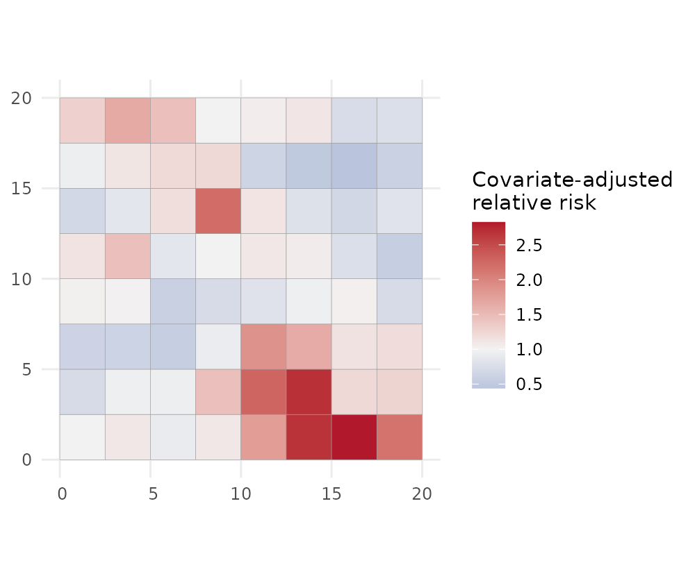
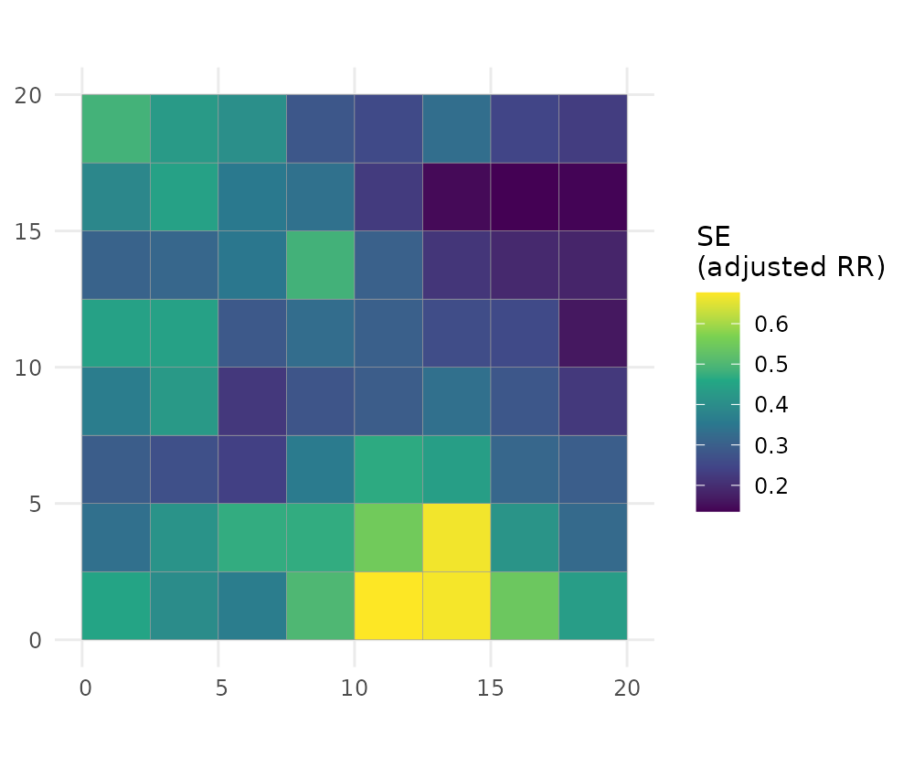
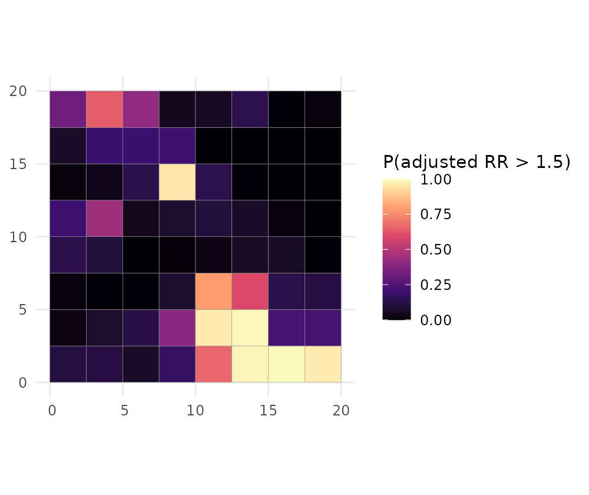
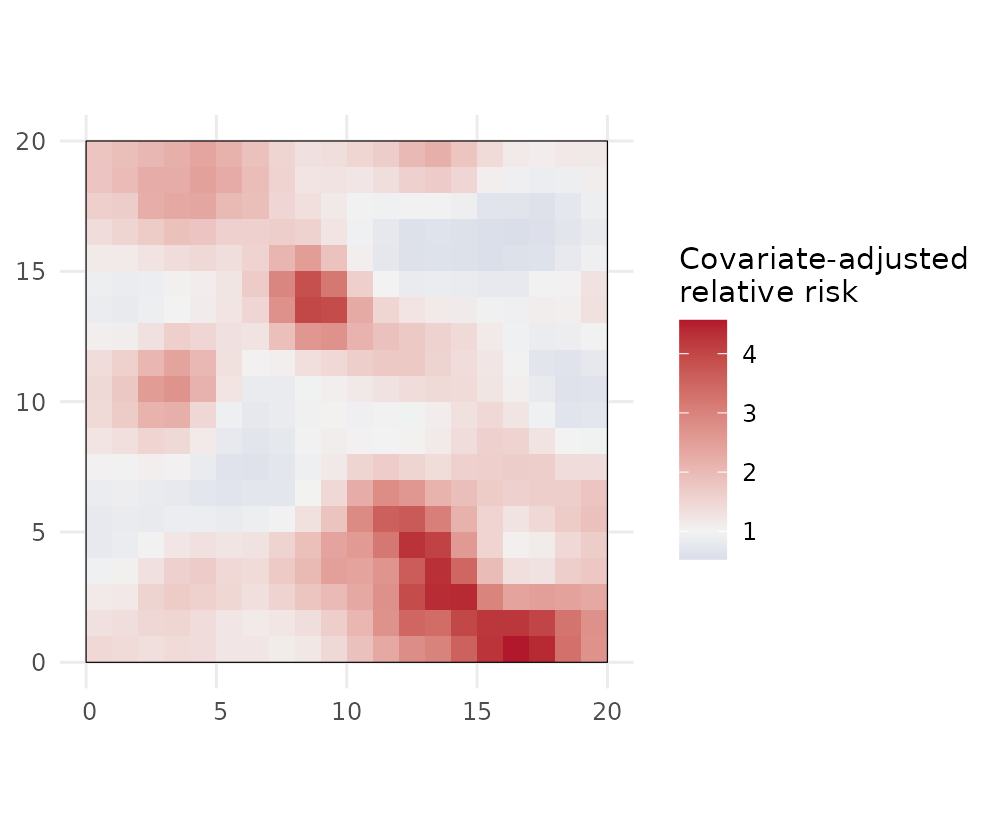
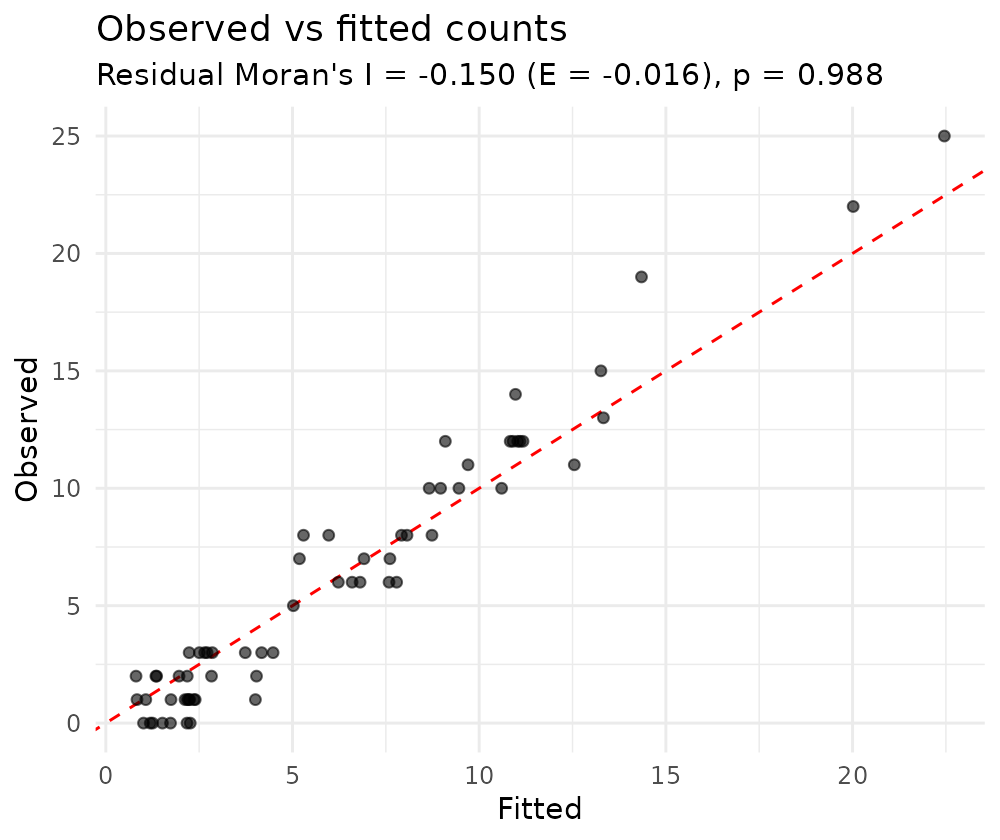

# 1. Spatial disease mapping with SDALGCP2

This tutorial fits a spatial disease-mapping model end to end. Every
code block runs as shown, using the bundled example dataset
`sdalgcp_data` so you can copy-paste and reproduce it exactly.

## The model

We observe disease counts $`Y_i`$ aggregated over areal units $`A_i`$
($`i=1,\dots,N`$) with an offset $`m_i`$ (the expected count,
e.g. population times a baseline rate). SDALGCP2 fits a **spatially
discrete approximation to a log-Gaussian Cox process**:
``` math
Y_i \mid S \;\sim\; \mathrm{Poisson}\!\big(m_i\, e^{\eta_i}\big),
\qquad
\eta_i \;=\; d_i^\top\beta \;+\; S_i,
```
where $`d_i`$ are area-level covariates and $`S=(S_1,\dots,S_N)`$ is a
Gaussian spatial random effect. $`S_i`$ is the average over area $`A_i`$
of a continuous Gaussian process $`S(x)`$ with exponential covariance
$`\mathrm{Cov}\{S(x),S(x')\}=\sigma^2\exp(-\lVert x-x'\rVert/\phi)`$;
aggregating this process over the areas gives an $`N\times N`$
covariance built from candidate points inside each region (see
Tutorial 4). The parameters are the coefficients $`\beta`$, the spatial
variance $`\sigma^2`$ and the range $`\phi`$.

Two quantities are reported for every area:

- **Relative risk** $`\mathrm{RR}_i=e^{\eta_i}=e^{d_i^\top\beta+S_i}`$ —
  the full relative risk, including the covariate effect (the
  `relative_risk` column);
- **Covariate-adjusted relative risk**
  $`\mathrm{RR}^{\mathrm{adj}}_i=e^{S_i}`$ — the residual spatial
  relative risk *after* adjusting for covariates (where is risk high/low
  beyond what the covariates explain?) — the `adjusted_rr` column.

## The data

[`sdalgcp()`](https://olatunjijohnson.github.io/SDALGCP2/reference/sdalgcp.md)
takes an `sf` object whose columns hold the response, covariates and
offset. The package ships a small simulated example, `sdalgcp_data`: 64
regions with a disease count (`cases`), a covariate (`x1`), and a
population offset (`pop`). It was generated with a true covariate effect
of `0.6` and a baseline log-rate of `-6`, so we can check the model
recovers them.

``` r

library(SDALGCP2)
library(sf)
#> Linking to GEOS 3.12.1, GDAL 3.8.4, PROJ 9.4.0; sf_use_s2() is TRUE

data(sdalgcp_data)
head(sdalgcp_data)
#> Simple feature collection with 6 features and 4 fields
#> Geometry type: POLYGON
#> Dimension:     XY
#> Bounding box:  xmin: 0 ymin: 0 xmax: 15 ymax: 2.5
#> CRS:           NA
#>   region cases          x1  pop                       geometry
#> 1      1     2 -2.03331626 3840 POLYGON ((0 0, 2.5 0, 2.5 2...
#> 2      2     3 -1.64601792 3985 POLYGON ((2.5 0, 5 0, 5 2.5...
#> 3      3     1 -1.25871959 2236 POLYGON ((5 0, 7.5 0, 7.5 2...
#> 4      4     0 -0.87142125  846 POLYGON ((7.5 0, 10 0, 10 2...
#> 5      5     3 -0.48412292  874 POLYGON ((10 0, 12.5 0, 12....
#> 6      6    12 -0.09682458 2231 POLYGON ((12.5 0, 15 0, 15 ...

# crude standardised incidence ratio (SIR): observed / expected-at-overall-rate
rate <- sum(sdalgcp_data$cases) / sum(sdalgcp_data$pop)
sdalgcp_data$SIR <- sdalgcp_data$cases / (sdalgcp_data$pop * rate)
```

The crude SIR is noisy and over-fits sparsely populated areas — exactly
what a model smooths:

``` r

plot(sdalgcp_data["SIR"], main = "Crude SIR (the data)")
```



``` r

plot(sdalgcp_data["x1"],  main = "Covariate x1")
```



## Fit

One call. Candidate-point spacing, the spatial range and MCMC settings
are chosen automatically; `reanchor` re-simulates the latent field at
the optimum a couple of times for reliable variance estimates. (We set a
seed and a shorter MCMC run here so the vignette is quick and
reproducible; the defaults are longer.)

``` r

set.seed(2024)
fit <- sdalgcp(cases ~ x1 + offset(log(pop)), data = sdalgcp_data,
               control = sdalgcp_control(n_sim = 4000, burnin = 1000, thin = 5,
                                         reanchor = 1))
summary(fit)
#> Call: sdalgcp(formula = cases ~ x1 + offset(log(pop)), data = sdalgcp_data, 
#>     control = sdalgcp_control(n_sim = 4000, burnin = 1000, thin = 5, 
#>         reanchor = 1))
#> 
#> Coefficients:
#>             Estimate Std.Err z value Pr(>|z|)    
#> (Intercept)   -6.226   0.143  -43.55  < 2e-16 ***
#> x1             0.660   0.136    4.84  1.3e-06 ***
#> sigma^2        0.876   0.378    2.32    0.021 *  
#> phi            1.207   0.448    2.69    0.007 ** 
#> ---
#> Signif. codes:  0 '***' 0.001 '**' 0.01 '*' 0.05 '.' 0.1 ' ' 1
#> 
#> Spatial scale phi: 1.20698
#> Log-likelihood: 0.574661
#> MC importance-sampling ESS: 102 / 600 (17%);  log-lik MC SE: 0.0902
#> Note: sigma^2 is the variance of the latent Gaussian process.
```

The covariate effect `x1` is estimated close to its true value of 0.6,
the spatial range `phi` and variance `sigma^2` describe the residual
spatial structure, and the importance-sampling effective sample size
reports how reliable the Monte Carlo likelihood is.

## Map the two relative risks

``` r

plot(fit, "relative_risk")   # relative risk exp(d'beta + S)
```



``` r

plot(fit, "adjusted_rr")     # covariate-adjusted relative risk exp(S)
```



`relative_risk` (left) is the overall pattern of risk; `adjusted_rr`
(right) strips out the covariate contribution and shows the
*unexplained* spatial signal — useful for spotting hotspots that the
covariates do not account for.

## Uncertainty and exceedance

Every quantity comes with a standard error, and you can ask for the
probability that risk exceeds a policy threshold:

``` r

plot(fit, "adjusted_rr_se")                  # standard error of the adjusted RR
```



``` r

plot(fit, "exceedance", threshold = 1.5)     # P(adjusted RR > 1.5)
```



The exceedance map is usually the most decision-relevant output: it
flags areas that are confidently above the threshold rather than high by
chance. By default the exceedance is computed for the covariate-adjusted
relative risk (`which = "adjusted_rr"`); pass `which = "relative_risk"`
for the full relative risk instead.

## A continuous surface

Risk can also be predicted on a fine grid (change-of-support), giving a
smooth surface instead of a choropleth:

``` r

pc <- predict(fit, type = "continuous", sampler = "laplace", cellsize = 1)
plot(pc, "adjusted_rr", bound = sdalgcp_data)
#> Coordinate system already present.
#> ℹ Adding new coordinate system, which will replace the existing one.
```



[`predict()`](https://rspatial.github.io/terra/reference/predict.html)
returns an `sf` with all four quantities (`relative_risk`, `adjusted_rr`
and their `_se`) for both `type = "discrete"` and `type = "continuous"`,
and
[`exceedance()`](https://olatunjijohnson.github.io/SDALGCP2/reference/exceedance.md)
works on either.

## Model checking

Finally, check that the spatial term has absorbed the spatial structure:
the Pearson residuals should show no leftover spatial autocorrelation.

``` r

chk <- model_check(fit)
```



``` r

chk$moran   # residual Moran's I and its permutation p-value
#> $I
#> [1] -0.1501438
#> 
#> $expected
#> [1] -0.01587302
#> 
#> $p_value
#> [1] 0.988
```

A non-significant residual Moran’s I indicates the model has captured
the spatial pattern, and the observed-vs-fitted points lie around the
identity line.

## Real data

`sdalgcp_data` is simulated so we know the truth. For a real example,
the package also ships `liver` — incident primary biliary cirrhosis
counts by LSOA in North East England (Johnson et al. 2019), which you
can fit the same way:

``` r

data(liver)
fit_liver <- sdalgcp(cases ~ IMD + offset(log(pop)), data = liver)
plot(fit_liver, "relative_risk")
```

## Next

- [Raster
  predictors](https://olatunjijohnson.github.io/SDALGCP2/articles/raster-covariates.md)
  — continuous covariates done right.
- [Spatio-temporal](https://olatunjijohnson.github.io/SDALGCP2/articles/spatio-temporal.md)
  — space–time relative risk.
- [Estimating the
  scale](https://olatunjijohnson.github.io/SDALGCP2/articles/scale-grid-vs-continuous.md)
  — what $`\phi`$ is and how it is estimated.
- [Spatial
  confounding](https://olatunjijohnson.github.io/SDALGCP2/articles/spatial-confounding.md)
  and [misaligned
  covariates](https://olatunjijohnson.github.io/SDALGCP2/articles/misaligned-covariates.md).
