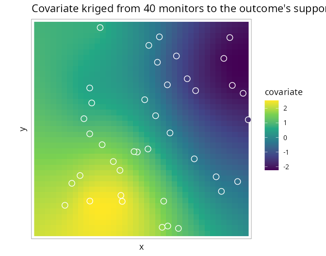

# 6. Covariates measured on a different support

Covariates are often observed on a *different support* from the outcome:
air quality at a few monitoring stations, temperature on a coarse
climate grid, deprivation on census tracts that do not match the health
districts. `SDALGCP2` aligns them by **predicting the covariate to the
candidate points** of the outcome regions and entering it with an
uncertainty-aware (Berkson) correction. This tutorial is self-contained.

## The method

The intensity-scale offset (Tutorial 2) needs the covariate
$`z(x_{ik})`$ at the candidate points $`x_{ik}`$. When $`z`$ is observed
elsewhere we (1) model it as a Gaussian process and **krige** it to
those points, obtaining a predictive mean $`\mu_z(x_{ik})`$ and variance
$`v_z(x_{ik})`$; (2) plug these into a **Berkson-corrected** offset
``` math
b_i(\beta)=\log\sum_k w_{ik}\,
\exp\!\Big\{\mu_z(x_{ik})^\top\beta+\tfrac12\,\beta^\top V_z(x_{ik})\,\beta\Big\}.
```
The $`\tfrac12\beta^\top V_z\beta`$ term propagates the prediction
uncertainty (plugging in the kriged mean alone would attenuate
$`\beta`$); as $`v_z\to0`$ it recovers the raster case. Derivation:
[`math/confounding-and-misalignment.pdf`](https://github.com/olatunjijohnson/SDALGCP2/blob/main/math/confounding-and-misalignment.pdf).

## Point support: monitoring stations

The covariate `z` is observed at 40 scattered monitors (an `sf` of
points with a `z` column); the outcome is counts over an 8×8 lattice.

``` r

library(SDALGCP2)
library(sf)

set.seed(123)
zf  <- function(xy) 1.5 * sin(xy[, 1] / 4) + 1.2 * cos(xy[, 2] / 5) + 0.5 * xy[, 1] / 20
reg <- st_sf(geometry = st_make_grid(
  st_as_sfc(st_bbox(c(xmin = 0, ymin = 0, xmax = 20, ymax = 20))), n = c(8, 8)))
N <- nrow(reg)

# simulate counts from the point-level intensity model (true beta_z = 0.8)
pts <- sda_points(reg, delta = 1.0, method = 3); w <- lapply(pts, function(p) p$weight)
b_true <- sapply(seq_len(N), function(i) {
  Z <- cbind(1, zf(as.matrix(pts[[i]]$xy))); log(sum(w[[i]] * exp(as.numeric(Z %*% c(-6, 0.8))))) })
reg$pop   <- round(runif(N, 800, 5000))
reg$cases <- rpois(N, reg$pop * exp(b_true))

# the covariate, observed ONLY at 40 monitors
mon <- st_as_sf(data.frame(x = runif(40, 0, 20), y = runif(40, 0, 20)), coords = c("x", "y"))
mon$z <- zf(st_coordinates(mon))
```

Pass the monitors through `covariates =`; `reg` does not need a `z`
column:

``` r

fit <- sdalgcp(cases ~ z + offset(log(pop)), data = reg, covariates = list(z = mon))
fit$beta_opt["z"]
#> 0.89   (true 0.8)
```

Internally the covariate is kriged from the monitors to every candidate
point:



The covariate’s own spatial model (range, nugget, variance) is estimated
by maximum likelihood; `SDALGCP2` then fits the outcome model with the
Berkson-corrected offset.

## Areal support: a different partition

If the covariate is reported as **averages over other polygons** (e.g. a
coarser grid or census tracts), supply those polygons. `SDALGCP2`
detects the geometry and uses *aggregated areal kriging*, reusing the
same C++ kernels that build the outcome correlation:

``` r

# covariate observed as averages over a coarser 4x4 partition
covpoly <- st_sf(geometry = st_make_grid(
  st_as_sfc(st_bbox(c(xmin = 0, ymin = 0, xmax = 20, ymax = 20))), n = c(4, 4)))
cpts <- sda_points(covpoly, delta = 1.0, method = 3)
covpoly$z <- sapply(cpts, function(p) mean(zf(as.matrix(p$xy))))   # areal averages

fit_areal <- sdalgcp(cases ~ z + offset(log(pop)), data = reg, covariates = list(z = covpoly))
fit_areal$beta_opt["z"]
```

    #> True z effect: 0.80
    #> Point support  (40 monitors):           0.89
    #> Areal support  (25 different polygons):  0.85

In both cases the covariate effect is recovered from data that were
never observed on the outcome’s own units — point monitors, or polygons
that do not match the outcome regions.

## Notes

- The candidate-point grid that discretises the outcome regions doubles
  as the common support on which outcome and covariate are aligned.
- Set `berkson = FALSE` in
  [`SDALGCP2_misaligned()`](https://olatunjijohnson.github.io/SDALGCP2/reference/SDALGCP2_misaligned.md)
  for the naive kriged-mean plug-in (no uncertainty propagation).
- Currently the covariate model’s *parameter* uncertainty is plugged in
  (its predictive uncertainty is propagated); a fully joint two-stage
  model is a natural extension. \`\`\`
