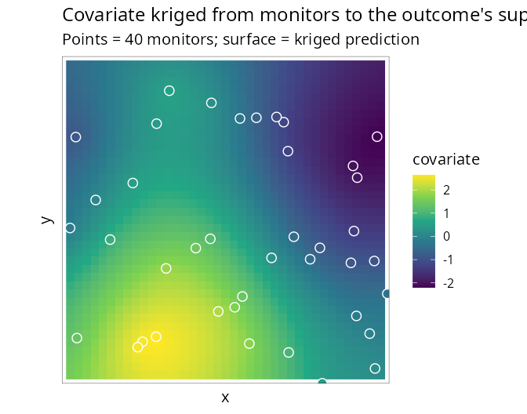

# 6. Covariates measured on a different support

Covariates are frequently observed on a *different support* from the
outcome: air quality at a handful of monitoring stations, temperature on
a coarse climate grid, deprivation on census tracts that do not match
the health districts the counts are reported on. `SDALGCP2` aligns them
by **predicting the covariate to the candidate points** of the outcome
regions and entering it with an uncertainty-aware (Berkson) correction.

## Point support: monitors

Suppose the covariate `z` is observed only at 40 scattered monitors (an
`sf` of points with a `z` column), while the outcome is counts over a
lattice. Pass the monitors through `covariates =`:

``` r

library(SDALGCP2)
library(sf)

# monitors: sf POINTs with a 'z' column ; regions: sf POLYGONs with cases, pop
fit <- sdalgcp(cases ~ z + offset(log(pop)), data = regions,
               covariates = list(z = monitors))
summary(fit)
```

Internally the covariate is kriged from the monitors to every candidate
point, giving a predictive mean **and variance** at each:



The fit then uses the intensity-scale offset with a Berkson term,
$`b_i(\beta)=\log\sum_k w_{ik}\exp\{z(x_{ik})^\top\beta+\tfrac12\beta^\top V_z(x_{ik})\beta\}`$,
so the prediction uncertainty is propagated rather than ignored (which
would attenuate $`\beta`$). On simulated data the effect (true 0.8) is
recovered as $`\approx 0.77`$ from the monitors alone. Set
`berkson = FALSE` in
[`SDALGCP2_misaligned()`](https://olatunjijohnson.github.io/SDALGCP2/reference/SDALGCP2_misaligned.md)
for the naive kriged-mean plug-in.

## Areal support: a different partition

If the covariate is reported as **averages over other polygons** (e.g. a
coarser grid or census tracts), supply those polygons instead —
`SDALGCP2` detects the geometry and uses *aggregated areal kriging*,
reusing the same C++ kernels that build the outcome correlation:

``` r

# covpoly: sf POLYGONs (a different partition) with a 'z' column of areal averages
fit_areal <- sdalgcp(cases ~ z + offset(log(pop)), data = regions,
                     covariates = list(z = covpoly))
```

Recovered effect on simulated data: $`\approx 0.85`$ (true 0.8), from a
covariate averaged over 25 polygons that do not match the 64 outcome
regions.

## Notes

The candidate-point grid that discretises the outcome regions doubles as
the common support on which outcome and covariate are aligned. The
covariate’s own spatial model (range, nugget, variance) is estimated by
maximum likelihood. Full derivation, including the Berkson correction
and the areal cross-covariances, is in
`math/confounding-and-misalignment.pdf`. \`\`\`
