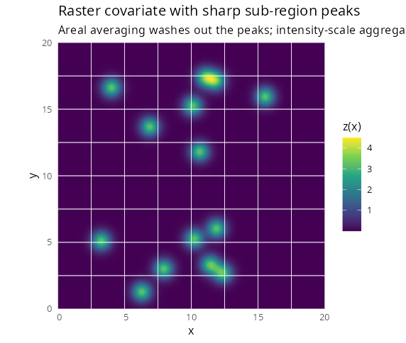
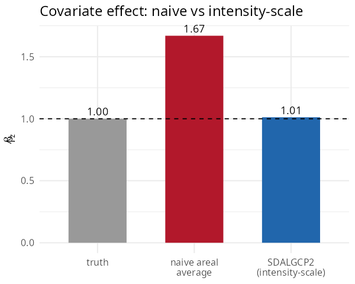

# 2. Spatially continuous (raster) predictors

Covariates often vary **within** an areal unit — elevation, pollution
from point sources, distance to a road. The usual shortcut is to average
the covariate over each polygon and put the average into a Poisson
model. Under the nonlinear log link this is **biased**. `SDALGCP2`
instead reads the covariate from a raster at the candidate points and
aggregates it on the *intensity* scale.

## The problem with averaging

A region’s expected count is
$`m_i \int_{A_i} \exp\{z(x)^\top\beta + S(x)\}\,dx`$. Averaging the
covariate first and exponentiating second is not the same as
exponentiating first and averaging: when $`z`$ has sharp features, the
average washes them out but the exponential does not. `SDALGCP2` uses
the correct log-sum-exp aggregation
$`b_i(\beta)=\log\sum_k w_{ik}\exp\{z(x_{ik})^\top\beta\}`$ (full
derivation in `math/raster-covariates-derivation.pdf`).



*A covariate with sharp sub-region peaks (e.g. point exposure sources).
White lines are region borders; the peaks sit inside regions and are
lost by areal averaging.*

## Fitting with a raster

Pass a
[`terra::SpatRaster`](https://rspatial.github.io/terra/reference/SpatRaster-class.html)
whose layers are named in the formula:

``` r

library(SDALGCP2)
library(sf)
library(terra)

# 'exposure' is a SpatRaster with a layer named 'z'; regions is an sf of counts
fit <- sdalgcp(cases ~ z + offset(log(pop)), data = regions, rasters = exposure)
summary(fit)
```

The covariate `z` is read from the raster at the candidate points inside
each region — `regions` does not need a `z` column.

## Areal averaging is biased; intensity-scale is not

On simulated data with sharp peaks (true effect $`\beta_z = 1`$):



    #> truth                       1.00
    #> naive areal average         1.67   (+67% bias)
    #> SDALGCP2 (intensity-scale)  1.01

The bias is largest when the within-region covariate variance is
correlated with the region mean (sharp localised features); for smooth
covariates the two approaches nearly agree.

## Options

`sdalgcp_control(tilt_spatial = TRUE)` additionally tilts the spatial
correlation by the covariate intensity (the fully tilted model); the
default keeps the correlation covariate-free and is faster. \`\`\`
