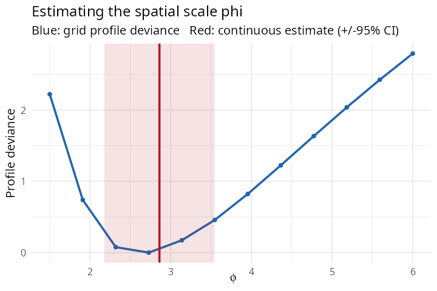

# 4. Estimating the spatial scale: grid vs continuous

The spatial scale $`\phi`$ controls how fast spatial correlation decays
with distance — it sets the “reach” of a hotspot. This tutorial explains
how `SDALGCP2` estimates it and is self-contained.

## Where $`\phi`$ lives: a double integral

The region-level random effect $`S_i`$ is the average over area $`A_i`$
of a continuous process $`S(x)`$ with
$`\mathrm{Cov}\{S(x),S(x')\}=\sigma^2 e^{-\lVert
x-x'\rVert/\phi}`$. The covariance between two regions is therefore a
**double integral** over the pair of areas:
``` math
R_{ij}(\phi)=\int_{A_i}\!\int_{A_j} w_i(x)\,w_j(y)\,
   \exp\!\Big(-\tfrac{\lVert x-y\rVert}{\phi}\Big)\,dx\,dy,
```
approximated by a weighted sum over the candidate points inside each
region. $`\phi`$ appears *inside* this integral, so the whole
$`N\times N`$ correlation matrix depends on it. There are two ways to
estimate it.

## Set up an example

``` r

library(SDALGCP2)
library(sf)

set.seed(11)
regions <- st_sf(geometry = st_make_grid(
  st_as_sfc(st_bbox(c(xmin = 0, ymin = 0, xmax = 20, ymax = 20))), n = c(9, 9)))
N <- nrow(regions)
pts <- sda_points(regions, delta = 1.1, method = 3)
S   <- as.numeric(t(chol(0.5 * precompute_corr(pts, 3)$R[, , 1])) %*% rnorm(N))  # true phi = 3
regions$x1    <- rnorm(N)
regions$pop   <- round(runif(N, 800, 4000))
regions$cases <- rpois(N, regions$pop * exp(-6 + 0.5 * regions$x1 + S))
```

## Grid (profile)

The classic approach (and that of the original `SDALGCP`): evaluate the
model on a **grid** of $`\phi`$ values and take the profile maximum.

``` r

fit_grid <- sdalgcp(cases ~ x1 + offset(log(pop)), data = regions,
                    control = sdalgcp_control(scale = "grid",
                                              phi = seq(1.5, 6, length.out = 12)))
```

## Continuous (direct) — the default

The aggregated correlation $`R(\phi)`$ is **differentiable** in
$`\phi`$: the derivative is obtained by differentiating the kernel
inside the integral,
$`\partial_\phi e^{-d/\phi}=e^{-d/\phi}\,d/\phi^2`$. `SDALGCP2`
therefore optimises $`\phi`$**directly**, jointly with $`\beta`$ and
$`\sigma^2`$, with no grid. This removes the grid-discretisation error
and — because $`\phi`$ is now a fitted parameter — yields a proper
**standard error** from the joint Hessian (full derivation:
[`math/continuous-phi-derivation.pdf`](https://github.com/olatunjijohnson/SDALGCP2/blob/main/math/continuous-phi-derivation.pdf)).

``` r

fit_dir <- sdalgcp(cases ~ x1 + offset(log(pop)), data = regions)  # scale = "continuous"
```

## They agree — and continuous gives a standard error

``` r

# (timings will vary)
```

    #> GRID:       phi = 2.73            beta_x1 = 0.437   [6.0s]
    #> CONTINUOUS: phi = 2.86 (SE 0.35)  beta_x1 = 0.449   [6.2s]



The blue curve is the grid profile deviance; its minimum (the grid
$`\hat\phi`$) falls between grid nodes. The red line is the continuous
estimate with its 95% confidence band — essentially the same value, but
obtained without choosing a grid and with an honest standard error that
the grid cannot provide.

## Which to use?

|  | grid | continuous (default) |
|----|----|----|
| $`\hat\phi`$ | restricted to grid nodes | exact, no discretisation error |
| SE for $`\phi`$ | not available | from the joint Hessian |
| profile shape | fully visible (good for multimodality) | not traced |
| Matérn smoothness | any | 0.5, 1.5, 2.5 |

Use **continuous** (the default) for a clean estimate with a standard
error and no grid to choose. Use **grid** when you want to inspect the
whole profile — e.g. to check for a flat or multimodal likelihood, with
`plot(fit_grid)`. Both are selected by `sdalgcp_control(scale = ...)`.
\`\`\`
