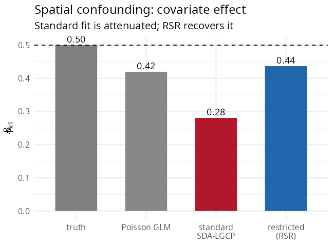

# 5. Spatial confounding and restricted spatial regression

When a covariate is itself spatially structured (a north–south gradient,
distance to a city, deprivation), it is collinear with the spatial
random effect. The random effect then *absorbs* the covariate’s signal,
and the estimated coefficient is **attenuated** with inflated variance.
This is *spatial confounding* (Reich, Hodges & Zadnik 2006; Hughes &
Haran 2013).

## Seeing the problem

Simulate counts where a spatially smooth covariate `x1` has a true
effect of 0.5, on top of a spatial field:

``` r

library(SDALGCP2)
library(sf)
# ... regions with a gradient covariate x1, offset pop, simulated cases ...

coef(glm(cases ~ x1 + offset(log(pop)), poisson, st_drop_geometry(regions)))["x1"]
fit_std <- sdalgcp(cases ~ x1 + offset(log(pop)), data = regions)
fit_std$beta_opt["x1"]
```

The standard SDA-LGCP fit attenuates the coefficient because the spatial
term has eaten part of the gradient:



    #> truth               0.50
    #> Poisson GLM         0.42
    #> standard SDA-LGCP   0.28   <- attenuated by confounding
    #> restricted (RSR)    0.44

## The fix: restricted spatial regression

Constrain the spatial random effect to the **orthogonal complement** of
the fixed-effect design, so it cannot reproduce any covariate. Turn it
on with one control argument:

``` r

fit_rsr <- sdalgcp(cases ~ x1 + offset(log(pop)), data = regions,
                   control = sdalgcp_control(confounding = "restricted"))
summary(fit_rsr)
```

`SDALGCP2` builds an orthonormal basis `K` of `null(Dᵀ)`, replaces the
random effect by `Kα` (which is orthogonal to every column of the
design), and fits the restricted model by a Laplace-approximate marginal
likelihood. The coefficient is now identified by the data, not by the
spatial smoothing, and the spatial term only captures the residual
structure. Full derivation: `math/confounding-and-misalignment.pdf`.

## When to use it

Use `confounding = "restricted"` when a covariate of interest is
spatially smooth and you care about an unbiased, interpretable
coefficient. If the covariates are non-spatial (e.g. an individual-level
rate), confounding is not an issue and the default fit is appropriate.
\`\`\`
