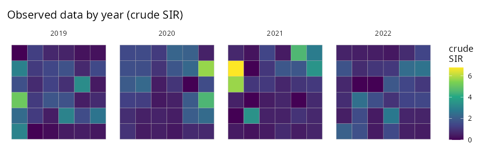
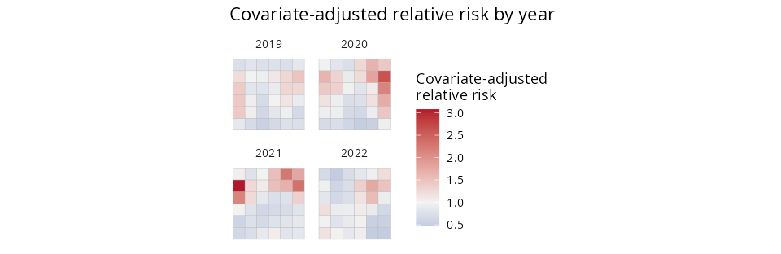
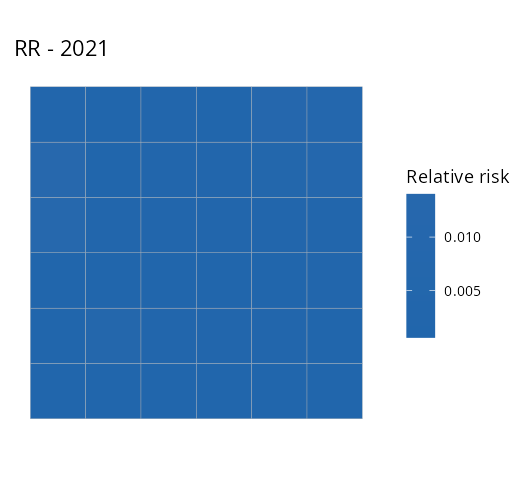
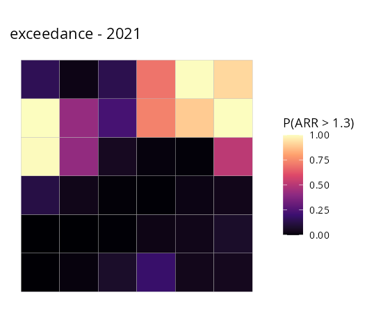

# 3. Spatio-temporal disease mapping

When the same regions are observed at several times, add `time =` and
`SDALGCP2` fits a separable space–time model. This tutorial is
self-contained.

## The model

For region $`i`$ at time $`t`$, counts $`Y_{it}`$ with offset
$`m_{it}`$:
``` math
Y_{it}\mid S \sim \mathrm{Poisson}\!\big(m_{it}\,e^{\eta_{it}}\big),
\qquad \eta_{it}=d_{it}^\top\beta + S_{it},
```
with a **separable** space–time covariance
``` math
\mathrm{Cov}(S_{it},S_{js}) \;=\; \sigma^2\,R_s(\lVert\cdot\rVert;\phi)_{ij}\;R_t(|t-s|;\nu)_{ts},
```
i.e. $`\mathrm{Cov}(\mathrm{vec}\,S)=\sigma^2\,(R_t(\nu)\otimes R_s(\phi))`$,
where $`R_s`$ is the aggregated spatial correlation (range $`\phi`$) and
$`R_t`$ a temporal Matérn correlation (range $`\nu`$). `SDALGCP2` never
forms the $`(N\!\cdot\!T)\times(N\!\cdot\!T)`$ covariance — it uses the
Kronecker identities
$`x^\top(R_t\otimes R_s)^{-1}x=\mathrm{tr}(R_s^{-1}M R_t^{-1}M^\top)`$
and $`\log|R_t\otimes R_s|=N\log|R_t|+T\log|R_s|`$ — so it scales to
many regions and times. The temporal range $`\nu`$ is estimated
alongside $`\beta,\sigma^2,\phi`$.

## The data

One row per region **and** time, with the geometry repeated. Here four
years on a 6×6 lattice:

``` r

library(SDALGCP2)
library(sf)

set.seed(7)
shp <- st_sf(geometry = st_make_grid(
  st_as_sfc(st_bbox(c(xmin = 0, ymin = 0, xmax = 18, ymax = 18))), n = c(6, 6)))
N <- nrow(shp); times <- 2019:2022; T <- length(times)

# simulate separable space-time counts (true beta=0.5)
pts <- sda_points(shp, delta = 1.4, method = 3)
Rs  <- precompute_corr(pts, 3)$R[, , 1]
Rt  <- SDALGCP2:::.temporal_corr(seq_len(T), 1.5, 0.5)
L   <- t(chol(0.4 * kronecker(Rt, Rs)))
x1  <- rnorm(N * T); pop <- round(runif(N * T, 1000, 5000))
y   <- rpois(N * T, pop * exp(-6 + 0.5 * x1 + as.numeric(L %*% rnorm(N * T))))

dat <- st_sf(
  data.frame(cases = y, x1 = x1, pop = pop, year = rep(times, each = N)),
  geometry = st_geometry(shp)[rep(seq_len(N), T)])
```



## Fit

``` r

fit <- sdalgcp(cases ~ x1 + offset(log(pop)), data = dat, time = "year",
               control = sdalgcp_control(reanchor = 2))
summary(fit)
```

    #> Coefficients:
    #>             Estimate Std.Err z value Pr(>|z|)
    #> (Intercept)  -6.167   0.107  -57.61   <2e-16 ***
    #> x1            0.592   0.038   15.73   <2e-16 ***
    #> sigma^2       0.491   0.205    2.39    0.017 *
    #> nu            0.853   0.360    2.37    0.018 *
    #>
    #> Spatial scale phi: 2.02

`nu` is the temporal range (correlation length in years); `phi` the
spatial range.

## Predict and map — pick a year and a quantity

[`predict()`](https://rspatial.github.io/terra/reference/predict.html)
returns $`N\times T`$ matrices of relative risk and covariate-adjusted
relative risk (with standard errors). The
[`plot()`](https://rspatial.github.io/terra/reference/plot.html) method
selects a **time** and a **quantity** (`"RR"`, `"ARR"`, `"RR_se"`,
`"ARR_se"`, `"exceedance"`):

``` r

pr <- predict(fit)

plot(pr, time = NULL, what = "ARR")                 # facet all years
plot(pr, time = 2021, what = "RR")                  # relative risk, 2021 only
plot(pr, time = 2021, what = "exceedance", threshold = 1.3, which = "ARR")
```

Covariate-adjusted relative risk, all years:



| Relative risk, 2021 | P(adjusted RR \> 1.3), 2021 |
|:-------------------:|:---------------------------:|
|  |         |

You can equally call `plot(fit, time = 2021, what = "RR")` directly on
the fit, and `pr$table` is a long data frame (region × time) of every
quantity for further analysis.

## Tips

Spatio-temporal fits profile the spatial range `phi` on a grid (set it
with `sdalgcp_control(phi = ...)`); the temporal range `nu` is estimated
continuously. Increase `reanchor` if the variance parameters look
unstable. \`\`\`
