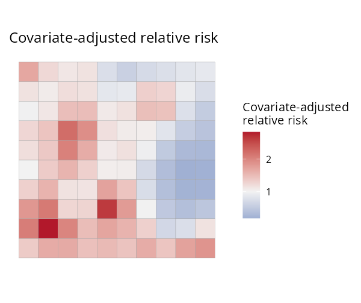
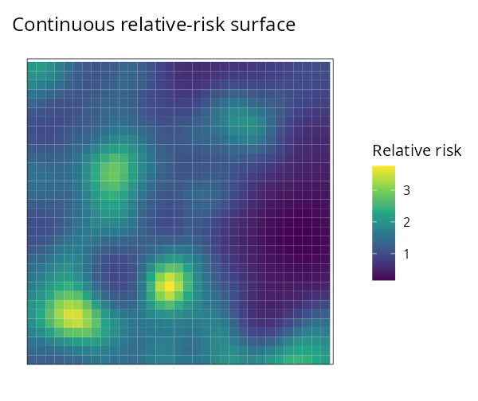

```{r, include = FALSE}
knitr::opts_chunk$set(collapse = TRUE, comment = "#>", eval = FALSE)
```

`SDALGCP2` fits a spatially discrete approximation to a log-Gaussian Cox process
(SDA-LGCP) to **aggregated disease counts** — counts observed over administrative
areas. The interface is deliberately close to `glm()`: give a formula and an `sf`
object and you are done.

## The data

`sdalgcp()` expects an `sf` object whose columns hold the response, covariates and
offset (population at risk). Here we simulate a 10×10 lattice with a spatial
signal; in practice this would be your shapefile joined to a counts table.

```{r}
library(SDALGCP2)
library(sf)

set.seed(42)
regions <- st_sf(geometry = st_make_grid(
  st_as_sfc(st_bbox(c(xmin = 0, ymin = 0, xmax = 20, ymax = 20))), n = c(10, 10)))
N <- nrow(regions)

# a covariate, a population offset, and simulated counts with a spatial hotspot
pts <- sda_points(regions, delta = 0.9, method = 3)
S   <- as.numeric(t(chol(0.5 * precompute_corr(pts, 4)$R[, , 1])) %*% rnorm(N))
regions$x1    <- rnorm(N)
regions$pop   <- round(runif(N, 800, 5000))
regions$cases <- rpois(N, regions$pop * exp(-6 + 0.6 * regions$x1 + S))
```

## Fit — one line

```{r}
fit <- sdalgcp(cases ~ x1 + offset(log(pop)), data = regions)
summary(fit)
```

No `delta`, no `phi`, no MCMC settings: the candidate-point spacing is chosen from
the region size, the spatial scale is optimised continuously, and the latent field
is re-anchored for reliable variances. To change any of this, pass
`control = sdalgcp_control(...)`.

```
#> Coefficients:
#>             Estimate Std.Err z value Pr(>|z|)
#> (Intercept)  -6.05     0.10   -60.0   <2e-16 ***
#> x1            0.58     0.08     7.2   5e-13  ***
#> sigma^2       0.46     0.18     2.6   0.009  **
#> phi           3.49     0.74     4.7   2e-06  ***
```

## Map the relative risk

`predict()` returns an `sf` you can map directly; `plot()` gives sensible defaults.

```{r}
rr <- predict(fit)             # sf with relative_risk, relative_risk_se, incidence
plot(fit)                      # covariate-adjusted relative risk
plot(fit, "risk_se")           # its uncertainty
plot(fit, "exceedance", threshold = 1.5)   # P(relative risk > 1.5)
```

| Relative risk | Uncertainty | Exceedance P(RR > 1.5) |
|:---:|:---:|:---:|
|  |  |  |

The **exceedance map** answers the question public-health users usually care about:
*where is the relative risk confidently above a threshold?*

## A continuous surface

Relative risk can also be predicted on a fine grid (change-of-support), giving a
smooth surface rather than a choropleth:

```{r}
pc <- predict(fit, type = "continuous", cellsize = 0.6)  # via the engine
plot(pc, "RR", bound = st_union(regions))
```

{width=60%}

## Model checking

```{r}
model_check(fit)        # observed vs fitted + residual Moran's I
mc_diagnostics(fit)     # importance-sampling effective sample size
```

A non-significant residual Moran's I indicates the spatial random effect has
absorbed the spatial structure.

## Where next

- [Raster predictors](raster-covariates.html) — continuous covariates done right.
- [Spatio-temporal](spatio-temporal.html) — space-time relative risk.
- [Estimating the scale](scale-grid-vs-continuous.html) — grid vs continuous `phi`.
```
