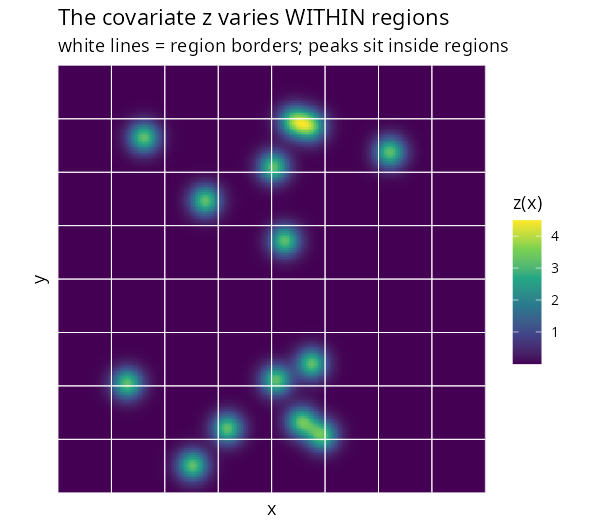
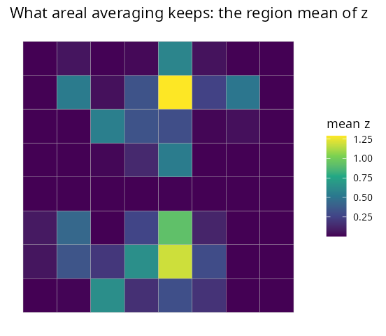
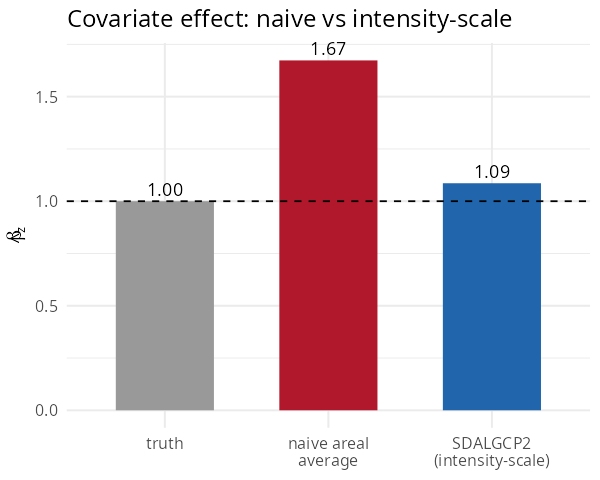
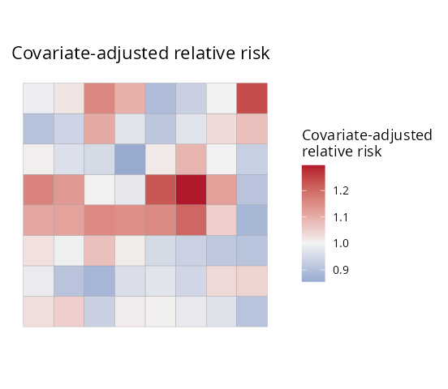

```{r, include = FALSE, purl = FALSE}
knitr::opts_chunk$set(collapse = TRUE, comment = "#>", eval = FALSE)
```

A covariate often varies **within** each areal unit — elevation, distance to a
road, pollution from point sources. The usual shortcut is to average it over each
polygon and put the average into a Poisson model. Under the nonlinear log link this
is **biased**. This tutorial shows why, and how `SDALGCP2` does it correctly. It is
self-contained.

## The problem, precisely

A region's expected count under the log-Gaussian Cox process is
\[
\mathbb{E}[Y_i\mid S] \;=\; m_i\int_{A_i} w_i(x)\,\exp\{z(x)^\top\beta + S(x)\}\,dx
\;\approx\; m_i\sum_{k} w_{ik}\,\exp\{z(x_{ik})^\top\beta + S(x_{ik})\},
\]
a sum over candidate points \(x_{ik}\) inside \(A_i\) with weights \(w_{ik}\). The
covariate enters **inside** the exponential. Factor it out:
\[
\mathbb{E}[Y_i\mid S] \;\approx\; m_i\,e^{\,b_i(\beta)}\sum_k c_{ik}\,e^{S(x_{ik})},
\qquad
\boxed{\,b_i(\beta)=\log\sum_k w_{ik}\,\exp\{z(x_{ik})^\top\beta\}\,}
\]
The region's covariate contribution is the **log-sum-exp** \(b_i(\beta)\), *not*
\((\bar z_i)^\top\beta\) with \(\bar z_i\) the areal mean. By Jensen's inequality the
two differ whenever \(z\) varies within the region, and a regression on \(\bar z_i\)
is biased for \(\beta\) — badly so when sharp features (e.g. point sources) sit
inside regions. Full derivation:
[`math/raster-covariates-derivation.pdf`](https://github.com/olatunjijohnson/SDALGCP2/blob/main/math/raster-covariates-derivation.pdf).

## The data

A covariate `z` with sharp peaks (think pollution sources), supplied as a
`terra::SpatRaster`, plus outcome counts over an 8×8 lattice. The peaks sit *inside*
regions, so the region mean loses them:

```{r, purl = FALSE}
library(SDALGCP2)
library(sf)
library(terra)

set.seed(3)
# a raster covariate with 14 sharp Gaussian peaks
r <- rast(xmin = 0, xmax = 20, ymin = 0, ymax = 20, resolution = 0.08)
xy  <- xyFromCell(r, 1:ncell(r))
src <- matrix(runif(2 * 14, 1, 19), ncol = 2)
values(r) <- rowSums(sapply(seq_len(nrow(src)), function(s)
  3.2 * exp(-((xy[, 1] - src[s, 1])^2 + (xy[, 2] - src[s, 2])^2) / 0.5)))
names(r) <- "z"

sh <- st_sf(geometry = st_make_grid(
  st_as_sfc(st_bbox(c(xmin = 0, ymin = 0, xmax = 20, ymax = 20))), n = c(8, 8)))
N <- nrow(sh)

# simulate counts from the point-level intensity model (true beta_z = 1)
pts <- sda_points(sh, delta = 0.5, method = 3); w <- lapply(pts, function(p) p$weight)
Z   <- lapply(pts, function(p) cbind(1, terra::extract(r, as.matrix(p$xy))[, "z"]))
b_true <- sapply(seq_len(N), function(i) log(sum(w[[i]] * exp(as.numeric(Z[[i]] %*% c(-6, 1))))))
sh$pop   <- round(runif(N, 2000, 6000))
sh$cases <- rpois(N, sh$pop * exp(b_true))
sh$zbar  <- sapply(seq_len(N), function(i) sum(w[[i]] * Z[[i]][, 2]))  # areal mean
```

| The raster covariate (varies within regions) | What areal averaging keeps |
|:---:|:---:|
|  |  |

The right panel — the region mean — has washed the peaks out.

## Fitting: naive vs intensity-scale

The naive analysis regresses counts on the areal mean:

```{r, purl = FALSE}
naive <- glm(cases ~ zbar + offset(log(pop)), poisson, st_drop_geometry(sh))
coef(naive)["zbar"]
#> 1.67   <- 67% too large
```

`SDALGCP2` instead reads `z` from the raster at the candidate points and uses the
log-sum-exp offset. Pass the raster; `sh` does not even need a `z` column:

```{r, purl = FALSE}
fit <- sdalgcp(cases ~ z + offset(log(pop)), data = sh, rasters = r)
coef(naive)["zbar"]; fit$beta_opt["z"]
```

```
#> Estimate of beta_z:
#>   truth                       1.00
#>   naive areal average         1.67   (+67% bias)
#>   SDALGCP2 (intensity-scale)  1.09
```

{width=55%}

Averaging the predictor over polygons overstates the effect by two-thirds;
aggregating on the intensity scale recovers it.

## When does it matter?

Because \(b_i(\beta)\approx\bar z_i^\top\beta+\tfrac12\beta^\top\widehat{\mathrm{Var}}_i(z)\beta\),
the bias is driven by the **within-region variance** of \(z\). It is large when that
variance is correlated with the region mean — sharp, localised features such as
point sources. For smooth covariates the two approaches nearly agree, and either is
fine.

## Output

As in Tutorial 1, the fit yields relative risk and covariate-adjusted relative risk
with standard errors and exceedance, both discrete and continuous:

```{r, purl = FALSE}
plot(fit, "adjusted_rr")                 # covariate-adjusted relative risk
plot(fit, "exceedance", threshold = 1.5)
```

{width=55%}

## Options

`sdalgcp_control(tilt_spatial = TRUE)` additionally tilts the spatial correlation by
the covariate intensity (the fully tilted model of the PDF); the default keeps the
correlation covariate-free and is faster.
```
