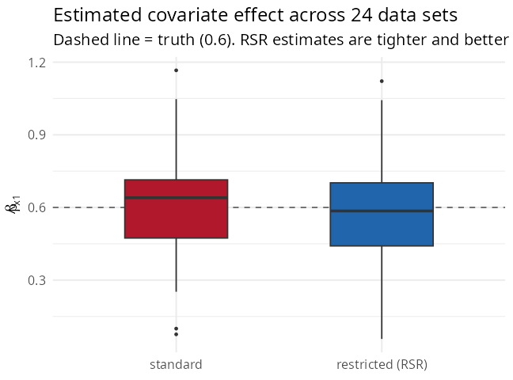

```{r, include = FALSE}
knitr::opts_chunk$set(collapse = TRUE, comment = "#>", eval = FALSE)
```

When a covariate is itself spatially structured (a north–south gradient,
deprivation, distance to a city), it is collinear with the spatial random effect:
the data can be explained almost equally well by "covariate effect" or by "spatial
noise". This is **spatial confounding**. This tutorial is self-contained and
deliberately balanced — spatial confounding is a genuinely nuanced topic.

## The issue

The model is \(\eta_i=d_i^\top\beta+S_i\) with \(S\sim\mathcal N(0,\sigma^2 R(\phi))\).
When a column of \(d\) lies close to the leading spatial modes of \(R(\phi)\), the
coefficient \(\beta\) and the random effect \(S\) compete to explain the same
pattern. The consequence is that \(\widehat\beta\) is poorly identified — uncertain,
and sensitive to how the spatial term is specified.

## Restricted spatial regression (RSR)

One remedy (Reich, Hodges & Zadnik 2006; Hughes & Haran 2013) constrains the random
effect to the **orthogonal complement** of the fixed-effect design. With \(K\) an
orthonormal basis of \(\mathrm{null}(D^\top)\), the model becomes
\[
\eta=D\beta+K\alpha,\qquad \alpha\sim\mathcal N\!\big(0,\sigma^2 K^\top R(\phi)K\big),
\]
so \(K\alpha\) cannot reproduce any column of \(D\) and \(\beta\) is identified by
the data, not by the spatial smoothing. `SDALGCP2` fits it by a Laplace-approximate
marginal likelihood (derivation:
[`math/confounding-and-misalignment.pdf`](https://github.com/olatunjijohnson/SDALGCP2/blob/main/math/confounding-and-misalignment.pdf)).

```{r}
library(SDALGCP2)
library(sf)

set.seed(2)
regions <- st_sf(geometry = st_make_grid(
  st_as_sfc(st_bbox(c(xmin = 0, ymin = 0, xmax = 20, ymax = 20))), n = c(8, 8)))
N <- nrow(regions)
pts <- sda_points(regions, delta = 1.2, method = 3)
S   <- as.numeric(t(chol(0.7 * precompute_corr(pts, 4)$R[, , 1])) %*% rnorm(N))
regions$x1    <- as.numeric(scale(st_coordinates(st_centroid(regions))[, 1]))  # spatial gradient
regions$pop   <- round(runif(N, 500, 3000))
regions$cases <- rpois(N, regions$pop * exp(-6 + 0.6 * regions$x1 + S))

# standard fit vs restricted spatial regression
fit_std <- sdalgcp(cases ~ x1 + offset(log(pop)), regions)
fit_rsr <- sdalgcp(cases ~ x1 + offset(log(pop)), regions,
                   control = sdalgcp_control(confounding = "restricted"))
```

## What RSR does — and what it does not

Because the single-dataset estimate depends on the (random) alignment of the spatial
field with the covariate, the honest way to see the effect is a small **simulation
study** — 24 data sets generated as above (true \(\beta=0.6\)), fitting both methods:

{width=55%}

```
#> Across 24 simulated data sets (true beta = 0.6):
#>   standard          mean est = 0.602,  SD of est = 0.265,  mean SE = 0.151
#>   restricted (RSR)  mean est = 0.587,  SD of est = 0.267,  mean SE = 0.074
```

Two things stand out:

* both methods are essentially **unbiased on average** (0.60 vs 0.59) — here the
  spatial term is genuine noise, not a hidden confounder, so neither systematically
  attenuates \(\beta\);
* RSR reports a much **smaller standard error** (0.074 vs 0.151). Its estimate is
  identified purely by the within-covariate signal, so it looks very precise.

**Caveat (important).** That small RSR standard error can be *anti-conservative*: it
does not reflect the across-data-set spread (\(\approx0.27\) here), because it
treats the spatial–covariate separation as known. This is the well-documented
critique of RSR (Hanks et al. 2015; Zimmerman & Ver Hoef 2021). Whether RSR helps
depends on the causal role of the spatial term: if it is just smooth noise, RSR
gives a clean, data-driven estimate; if it is a proxy for an *unmeasured spatial
confounder*, the unrestricted model may actually be preferable.

## Practical guidance

* Use `confounding = "restricted"` when you want a coefficient identified by the
  covariate's own variation, free of the spatial smoothing — but treat its standard
  error as a lower bound.
* When covariates are non-spatial (e.g. an individual-level rate), confounding is
  not a concern and the default fit is appropriate.
* In all cases, report which choice you made: the spatial term and the covariate are
  partly interchangeable, and that is a property of the data, not a bug.

## References

Reich, Hodges & Zadnik (2006) *Biometrics*; Hughes & Haran (2013) *JRSS-B*;
Hanks, Schliep, Hooten & Hoeting (2015) *Environmetrics*; Zimmerman & Ver Hoef
(2021) *Spatial Statistics*.
```
