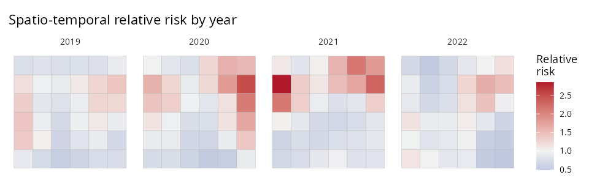

```{r, include = FALSE}
knitr::opts_chunk$set(collapse = TRUE, comment = "#>", eval = FALSE)
```

When the same regions are observed at several time points, add `time =` the name
of the time column and `sdalgcp()` fits a separable space-time SDA-LGCP. The
spatial scale `phi` is estimated alongside a temporal Matern range `nu`.

## The data

One row per region **and** time, with the geometry repeated. Here, four years on a
6×6 lattice:

```{r}
library(SDALGCP2)
library(sf)

set.seed(7)
shp   <- st_sf(geometry = st_make_grid(
  st_as_sfc(st_bbox(c(xmin = 0, ymin = 0, xmax = 18, ymax = 18))), n = c(6, 6)))
N <- nrow(shp); times <- 2019:2022; T <- length(times)

# simulate space-time counts (separable covariance) ...
dat <- st_sf(
  data.frame(cases = y, x1 = x1, pop = pop, year = rep(times, each = N)),
  geometry = st_geometry(shp)[rep(seq_len(N), T)])
```

## Fit

```{r}
fit <- sdalgcp(cases ~ x1 + offset(log(pop)), data = dat, time = "year")
summary(fit)
```

Internally the likelihood never forms the \((N\cdot T)\times(N\cdot T)\) covariance —
it uses the Kronecker identities
\(x^\top(R_t\otimes R_s)^{-1}x = \mathrm{tr}(R_s^{-1} M R_t^{-1} M^\top)\) and
\(\log|R_t\otimes R_s| = N\log|R_t| + T\log|R_s|\) — so it scales to many regions
and times.

## Map relative risk by time

`predict()` returns region-by-time matrices and a long table:

```{r}
pred <- predict(fit)
str(pred$ARR_mean)   # N x T matrix of covariate-adjusted relative risk

# join one time slice back to the geometry to map, or facet all of them:
library(ggplot2)
maps <- do.call(rbind, lapply(seq_len(T), function(t) {
  g <- shp; g$RR <- pred$ARR_mean[, t]; g$year <- times[t]; g
}))
ggplot(maps) +
  geom_sf(aes(fill = RR), color = "grey70", linewidth = 0.1) +
  facet_wrap(~year, nrow = 1) +
  scale_fill_gradient2(midpoint = 1, low = "#2166AC", mid = "grey95", high = "#B2182B")
```



The hotspot in the upper-right intensifies through 2020–2021 and recedes by 2022 —
the kind of space-time pattern that area-by-area or year-by-year analyses miss.

## Tip

Spatio-temporal fits use a `phi` grid (set via `sdalgcp_control(phi = ...)`); the
temporal range `nu` is estimated continuously. Increase `reanchor` in the control
if the variance parameters look unstable.
```
